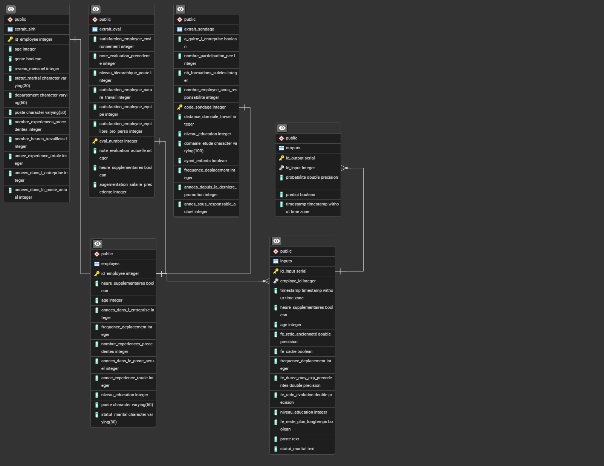

<a id="readme-top"></a>

<!-- PROJECT SHIELDS -->


<br />

<div align="center">
  <a href="https://github.com/RandomFab/FUTURISYS">
    
  </a>

  <h2 align="center">🚀 FUTURISYS — Déploiement d’un modèle de Machine Learning</h2>

  <p align="center">
    Projet pédagogique et pré-commercial de déploiement d’un modèle de Machine Learning via FastAPI et Docker.<br/>
    <a href="https://randomfab-futurisys.hf.space/docs"><strong>→ Voir l’API en ligne sur Hugging Face Spaces »</strong></a>
    <br /><br />
    <a href="#usage">Exemples d'utilisation</a> ·
    <a href="#tests">Tests</a> ·
    <a href="#roadmap">Feuille de route</a> ·
    <a href="#contact">Contact</a>
  </p>
</div>

---

## Sommaire

1. [À propos du projet](#à-propos-du-projet)
2. [Structure du projet](#structure-du-projet)
3. [Installation](#installation)
4. [Utilisation](#usage)
5. [Détails techniques du modèle](#🧠-détails-techniques-du-modèle)
6. [Tests](#tests)
7. [CI/CD et déploiement](#⚡️-intégration-continue-cicd)
8. [Base de données et traçabilité](#base-de-données-et-traçabilité)
9. [Technologies utilisées](#🧩-technologies-utilisées)
10. [Feuille de route](#roadmap)
11. [Licence](#licence)
12. [Contact](#contact)

---

## À propos du projet
<p align="right"><a href="#sommaire">⬆️ Revenir au sommaire</a></p>

FUTURISYS est une entreprise innovante souhaitant rendre ses modèles de machine learning **accessibles via une API performante**.  
Ce projet vise à **déployer un modèle de classification** issu du projet *“Classification automatique d’informations”*.

**Objectifs principaux :**
- Exposer un modèle ML via une API **FastAPI**.  
- Gérer la traçabilité via **PostgreSQL**.  
- Mettre en place une **pipeline CI/CD GitHub Actions**.  
- Déployer sur **Hugging Face Spaces** via Docker.  
- Documenter et tester entièrement le projet.

---

## Structure du projet
<p align="right"><a href="#sommaire">⬆️ Revenir au sommaire</a></p>

```
FUTURISYS/
├── app/
│   ├── main.py                # Point d'entrée de l'API FastAPI
│   ├── model/                 # Modèle entraîné + préprocesseur
│   │   ├── model.joblib
│   │   └── preprocessing.joblib
│   ├── utils/                 # Fonctions utilitaires
│   └── tests/                 # Tests unitaires Pytest
├── data/                      # Jeux de données
├── pyproject.toml             # Géré par uv
├── uv.lock
├── .python-version
├── Dockerfile                 # Pour l'initialisation sur huggingface
├── .github/
│   └── workflows/ci.yml       # Pipeline CI/CD (GitHub Actions)
└── README.md
```

---

## Installation
<p align="right"><a href="#sommaire">⬆️ Revenir au sommaire</a></p>

### 🔧 Prérequis

- [Python 3.13](https://www.python.org/downloads/)  
- [uv](https://docs.astral.sh/uv/)  
- [Git](https://git-scm.com/)  
- [Docker](https://www.docker.com/)  

### 💻 Cloner le dépôt

```bash
git clone https://github.com/RandomFab/FUTURISYS.git
cd FUTURISYS
```

### 📦 Installer les dépendances

```bash
uv sync
```

### 🚀 Lancer l’application

```bash
uvicorn app.main:app --reload
```

API disponible sur :
- Dev : http://127.0.0.1:8000  
- Prod : https://randomfab-futurisys.hf.space  
→ Swagger : http://127.0.0.1:8000/docs

---

## Usage
<p align="right"><a href="#sommaire">⬆️ Revenir au sommaire</a></p>

### 📄 Liste des endpoints
| Endpoint | Description |
|-----------|--------------|
| `/docs` | Documentation Swagger |
| `/threshold` | Seuil de classification |
| `/features` | Liste des features |
| `/model-info` | Informations du modèle |
| `/predict_from_transformed_data` | Prédiction avec datas transformées |
| `/predict_from_raw_data` | Prédiction avec datas brutes |
| `/predict_from_db_employe` | Prédiction via BDD employés |

### Exemple Python :
```python
import requests

url = "http://127.0.0.1:8000/predict_from_raw_data"
payload = {
    "heure_supplementaires": 1,
    "age": 35,
    "frequence_deplacement": 1,
    "niveau_education": 1,
    "poste": "Assistant de Direction",
    "statut_marital": "Célibataire",
    "annees_dans_l_entreprise": 5,
    "nombre_experiences_precedentes": 2,
    "annees_dans_le_poste_actuel": 1,
    "annee_experience_totale": 10
}
response = requests.post(url, json=payload)
print(response.json())
```

---

## Détails techniques du modèle
<p align="right"><a href="#sommaire">⬆️ Revenir au sommaire</a></p>

### Description
- **Modèle :** HistGradientBoostingClassifier  
- **Tâche :** Classification binaire (Reste(0) / Quitte(1) l’entreprise)  
- **Objectif :** Anticiper le départ d’un collaborateur  
- **Source :** Données internes TECHNOVA

### Entraînement :
```python
pipeline = IMBpipeline([
    ('preprocessing', preprocessor),
    ('smote', SMOTE(sampling_strategy=0.2, random_state=42)),
    ('under', RandomUnderSampler(sampling_strategy=0.8, random_state=42)),
    ('model', HistGradientBoostingClassifier(random_state=42))
])
```

Optimisation : **Recall** prioritaire pour détecter les départs.  
Sauvegarde via **joblib**.

---

## Tests
<p align="right"><a href="#sommaire">⬆️ Revenir au sommaire</a></p>

```bash
uv run pytest --maxfail=1 --disable-warnings -q --cov=. --cov-report=html
```

Rapport HTML complet dans `/htmlcov`.

---

## ⚡️ Intégration Continue (CI/CD)
<p align="right"><a href="#sommaire">⬆️ Revenir au sommaire</a></p>

Pipeline **GitHub Actions** :
- Tests à chaque push ou PR.  
- Rapport de couverture.  
- Déploiement automatique sur **Hugging Face Spaces**.


Secrets configurés via GitHub.

---

## Base de données et traçabilité
<p align="right"><a href="#sommaire">⬆️ Revenir au sommaire</a></p>

Intégration PostgreSQL pour tracer les **inputs** et **outputs** du modèle.



---

## 🧩 Technologies utilisées
<p align="right"><a href="#sommaire">⬆️ Revenir au sommaire</a></p>

| Technologie | Usage |
|--------------|-------|
| Python 3.13 | Langage principal |
| FastAPI | API |
| uv | Dépendances |
| scikit-learn / imbalanced-learn | ML |
| SQLAlchemy / psycopg2 | ORM / PostgreSQL |
| pytest / pytest-cov | Tests |
| Docker | Conteneurisation |
| GitHub Actions | CI/CD |
| Hugging Face Spaces | Déploiement |

---

## Roadmap
<p align="right"><a href="#sommaire">⬆️ Revenir au sommaire</a></p>

- ✅ Création du dépôt
- ✅ API FastAPI
- ✅ PostgreSQL
- ✅ CI/CD
- ✅ Déploiement HF
- ✅ Documentation finale

---

## Licence
<p align="right"><a href="#sommaire">⬆️ Revenir au sommaire</a></p>

📄 Projet **pédagogique et commercial** — tous droits réservés.  
Utilisable à des fins éducatives et démonstratives.  
Toute réutilisation commerciale doit mentionner **RandomFab**.

---

## Contact
<p align="right"><a href="#sommaire">⬆️ Revenir au sommaire</a></p>

👤 **Auteur :** [RandomFab](https://github.com/RandomFab)  
🌐 **Démo :** [randomfab-futurisys.hf.space](https://randomfab-futurisys.hf.space)

<p align="right">(<a href="#readme-top">⬆ Retour en haut</a>)</p>
